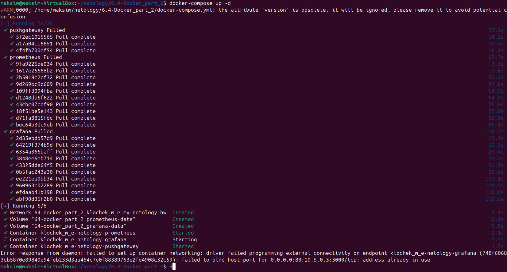
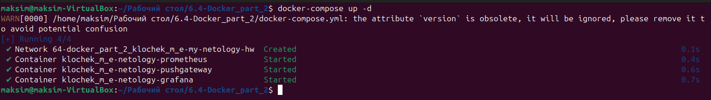
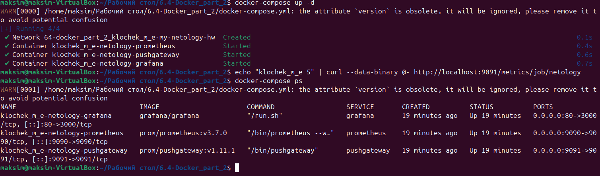
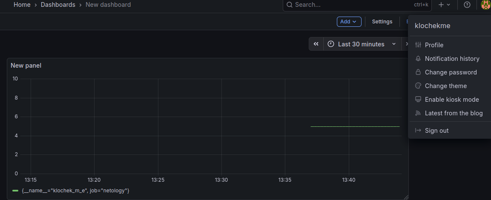
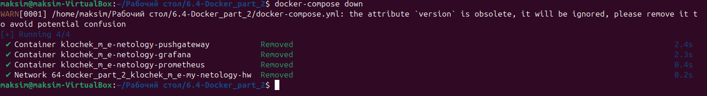

# Домашнее задание к занятию "`Docker. Часть 2`" - `Клочек Максим Евгеньевич`


### Задание 1

**Напишите ответ в свободной форме, не больше одного абзаца текста.**

Установите Docker Compose и опишите, для чего он нужен и как может улучшить лично вашу жизнь.


`Позволяет запускать несколько контейнеров используя фаил конфигуации YAML, упрощает разветыванеие и управление много контейнерным приложением, не придётся запускать каждый контейнер по отдельности запоминать ключи для них`

---

### Задание 2 

**Выполните действия и приложите текст конфига на этом этапе.** 

Создайте файл docker-compose.yml и внесите туда первичные настройки: 

 * version;
 * services;
 * volumes;
 * networks.

При выполнении задания используйте подсеть 10.5.0.0/16.
Ваша подсеть должна называться: <ваши фамилия и инициалы>-my-netology-hw.
Все приложения из последующих заданий должны находиться в этой конфигурации.

```
version: "3"
services:

volumes:

networks:
  klochek_m_e-my-netology-hw:
    ipam:
      config:
        - subnet: 10.5.0.0/16
          gateway: 10.5.0.1
```

---

### Задание 3 

**Выполните действия:** 

1. Создайте конфигурацию docker-compose для Prometheus с именем контейнера <ваши фамилия и инициалы>-netology-prometheus. 
2. Добавьте необходимые тома с данными и конфигурацией (конфигурация лежит в репозитории в директории [6-04/prometheus](https://github.com/netology-code/sdvps-homeworks/tree/main/lecture_demos/6-04/prometheus) ).
3. Обеспечьте внешний доступ к порту 9090 c докер-сервера.

---

1. `Создать директорию prometheus и скопировать туда`  [6-04/prometheus/prometheus.yml](https://github.com/netology-code/sdvps-homeworks/tree/main/lecture_demos/6-04/prometheus/prometheus.yml)
2. `дополнить docker-compose.yml`

```
version: '3'
services:
  prometheus:
    image: prom/prometheus:v3.7.0
    container_name: klochek_m_e-netology-prometheus
    command: --web.enable-lifecycle --config.file=/etc/prometheus/prometheus.yml
    ports:
    - 9090:9090
    volumes:
    - ./prometheus:/etc/prometheus
    - prometheus-data:/prometheus
    networks:
    - klochek_m_e-my-netology-hw
    restart: always

volumes: 
  prometheus-data:

networks:
  klochek_m_e-my-netology-hw:
    ipam:
      config:
        - subnet: 10.5.0.0/16
          gateway: 10.5.0.1

```

---

### Задание 4 

**Выполните действия:**

1. Создайте конфигурацию docker-compose для Pushgateway с именем контейнера <ваши фамилия и инициалы>-netology-pushgateway. 
2. Обеспечьте внешний доступ к порту 9091 c докер-сервера.
---

```
version: '3'
services:
  prometheus:
    image: prom/prometheus:v3.7.0
    container_name: klochek_m_e-netology-prometheus
    command: --web.enable-lifecycle --config.file=/etc/prometheus/prometheus.yml
    ports:
    - 9090:9090
    volumes:
    - ./prometheus:/etc/prometheus
    - prometheus-data:/prometheus
    networks:
    - klochek_m_e-my-netology-hw
    restart: always
  pushgateway:
    image: prom/pushgateway:v1.11.1
    container_name: klochek_m_e-netology-pushgateway
    ports:
    - 9091:9091
    networks:
    - klochek_m_e-my-netology-hw
    depends_on:
    - prometheus
    restart: unless-stopped

volumes: 
  prometheus-data:

networks:
  klochek_m_e-my-netology-hw:
    ipam:
      config:
        - subnet: 10.5.0.0/16
          gateway: 10.5.0.1

```

---

### Задание 5 

**Выполните действия:** 

1. Создайте конфигурацию docker-compose для Grafana с именем контейнера <ваши фамилия и инициалы>-netology-grafana. 
2. Добавьте необходимые тома с данными и конфигурацией (конфигурация лежит в репозитории в директории [6-04/grafana](https://github.com/netology-code/sdvps-homeworks/blob/main/lecture_demos/6-04/grafana/custom.ini).
3. Добавьте переменную окружения с путем до файла с кастомными настройками (должен быть в томе), в самом файле пропишите логин=<ваши фамилия и инициалы> пароль=netology.
4. Обеспечьте внешний доступ к порту 3000 c порта 80 докер-сервера.
---

1. создать папку grafana, в ней файлик custom.ini из лекции, внести измененния для задания

```
version: '3'
services:
  prometheus:
    image: prom/prometheus:v3.7.0
    container_name: klochek_m_e-netology-prometheus
    command: --web.enable-lifecycle --config.file=/etc/prometheus/prometheus.yml
    ports:
    - 9090:9090
    volumes:
    - ./prometheus:/etc/prometheus
    - prometheus-data:/prometheus
    networks:
    - klochek_m_e-my-netology-hw
    restart: always
  pushgateway:
    image: prom/pushgateway:v1.11.1
    container_name: klochek_m_e-netology-pushgateway
    ports:
    - 9091:9091
    networks:
    - klochek_m_e-my-netology-hw
    depends_on:
    - prometheus
    restart: unless-stopped
  grafana:
   image: grafana/grafana
   container_name: klochek_m_e-netology-grafana
   environment:
    GF_PATHS_CONFIG: /etc/grafana/custom.ini
   ports:
   - 80:3000
   volumes:
   - ./grafana:/etc/grafana
   - grafana-data:/var/lib/grafana
   networks:
   - klochek_m_e-my-netology-hw
   depends_on:
   - prometheus
   restart: unless-stopped

volumes: 
  prometheus-data:
  grafana-data:

networks:
  klochek_m_e-my-netology-hw:
    ipam:
      config:
        - subnet: 10.5.0.0/16
          gateway: 10.5.0.1

```

### Задание 6 

**Выполните действия.**

1. Настройте поочередность запуска контейнеров.
2. Настройте режимы перезапуска для контейнеров.
3. Настройте использование контейнерами одной сети.
5. Запустите сценарий в detached режиме.

---
В передыдущих заданиях это уже было сделано

1. **depends_on:** - указывает после запуска какого контейнера разрешено самускать этот
2. **restart:** - задаёт правило перезапуска
3. **networks:** - доступные для контейненра сети
4. `docker-compose up -d`




Была проблема с графаной из-за уже запущенного сервиса на 80 порту (из прошлых ДЗ)
И вторая проблема с владельцами конфигурационных файлов когда подключал общую папку с Windows в VirtualBox



---

### Задание 7 

**Выполните действия.**
1. Выполните запрос в Pushgateway для помещения метрики <ваши фамилия и инициалы> со значением 5 в Prometheus: ```echo "<ваши фамилия и инициалы> 5" | curl --data-binary @- http://localhost:9091/metrics/job/netology```.
2. Залогиньтесь в Grafana с помощью логина и пароля из предыдущего задания.
3. Cоздайте Data Source Prometheus (Home -> Connections -> Data sources -> Add data source -> Prometheus -> указать "Prometheus server URL = http://prometheus:9090" -> Save & Test).
4. Создайте график на основе добавленной в пункте 5 метрики (Build a dashboard -> Add visualization -> Prometheus -> Select metric -> Metric explorer -> <ваши фамилия и инициалы -> Apply.

В качестве решения приложите:

* docker-compose.yml **целиком**;
* скриншот команды docker ps после запуске docker-compose.yml;
* скриншот графика, постоенного на основе вашей метрики.
  
  ---


```
version: '3'
services:
  prometheus:
    image: prom/prometheus:v3.7.0
    container_name: klochek_m_e-netology-prometheus
    command: --web.enable-lifecycle --config.file=/etc/prometheus/prometheus.yml
    ports:
    - 9090:9090
    volumes:
    - ./prometheus:/etc/prometheus
    - prometheus-data:/prometheus
    networks:
    - klochek_m_e-my-netology-hw
    restart: always
  pushgateway:
    image: prom/pushgateway:v1.11.1
    container_name: klochek_m_e-netology-pushgateway
    ports:
    - 9091:9091
    networks:
    - klochek_m_e-my-netology-hw
    depends_on:
    - prometheus
    restart: unless-stopped
  grafana:
   image: grafana/grafana
   container_name: klochek_m_e-netology-grafana
   environment:
    GF_PATHS_CONFIG: /etc/grafana/custom.ini
   ports:
   - 80:3000
   volumes:
   - ./grafana:/etc/grafana
   - grafana-data:/var/lib/grafana
   networks:
   - klochek_m_e-my-netology-hw
   depends_on:
   - prometheus
   restart: unless-stopped

volumes: 
  prometheus-data:
  grafana-data:

networks:
  klochek_m_e-my-netology-hw:
    ipam:
      config:
        - subnet: 10.5.0.0/16
          gateway: 10.5.0.1

```





---

### Задание 8

**Выполните действия:** 

1. Остановите и удалите все контейнеры одной командой.

В качестве решения приложите скриншот консоли с проделанными действиями.

---

1. `docker-compose down`



---

## Дополнительные задания* (со звёздочкой)

Их выполнение необязательное и не влияет на получение зачёта по домашнему заданию. Можете их решить, если хотите лучше разобраться в материале.

---

### Задание 9* 

**Выполните действия:** 

1. Создайте конфигурацию docker-compose для Alertmanager с именем контейнера <ваши фамилия и инициалы>-netology-alertmanager. 
2. Добавьте необходимые тома с данными и [конфигурацией](https://github.com/netology-code/sdvps-homeworks/tree/main/6-04/alertmanager), сеть, режим и очередность запуска.
3. Обновите конфигурацию Prometheus (необходимые изменения ищите в презентации или документации) и перезапустите его. 
4. Обеспечьте внешний доступ к порту 9093 c докер-сервера.

В качестве решения приложите скриншот с событием из Alertmanager.


---
1. `Заполните здесь этапы выполнения, если требуется ....`
2. `Заполните здесь этапы выполнения, если требуется ....`
3. `Заполните здесь этапы выполнения, если требуется ....`
4. `Заполните здесь этапы выполнения, если требуется ....`
5. `Заполните здесь этапы выполнения, если требуется ....`
6. 

```
Поле для вставки кода...
....
....
....
....
```

`При необходимости прикрепитe сюда скриншоты
`

---

### Задание 10* 

Запустите свой сценарий на чистом железе без предзагруженных образов.

**Ответьте на вопросы в свободной форме:**

1. Опишите выполненный вами процесс развертывания сценария.
2. Как вы думаете зачем может понадобиться такой способ развертывания?
---
1. `Заполните здесь этапы выполнения, если требуется ....`
2. `Заполните здесь этапы выполнения, если требуется ....`
3. `Заполните здесь этапы выполнения, если требуется ....`
4. `Заполните здесь этапы выполнения, если требуется ....`
5. `Заполните здесь этапы выполнения, если требуется ....`
6. 

```
Поле для вставки кода...
....
....
....
....
```

`При необходимости прикрепитe сюда скриншоты
`